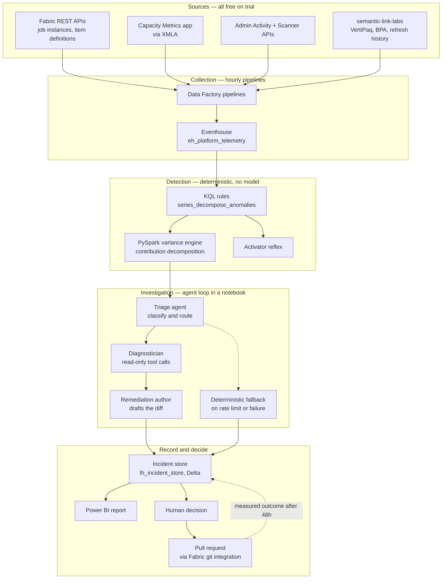

# Architecture

## Contents

- [Shaping constraints](#shaping-constraints)
- [The three-layer split](#the-three-layer-split)
- [System diagram](#system-diagram)
- [Layer 1 — Collection](#layer-1--collection)
- [Layer 2 — Detection](#layer-2--detection)
- [Layer 3 — Investigation](#layer-3--investigation)
- [Remediation and the human gate](#remediation-and-the-human-gate)
- [The incident store](#the-incident-store)
- [Walkthrough of a single incident](#walkthrough-of-a-single-incident)
- [Security posture](#security-posture)
- [Capacity budget](#capacity-budget)
- [Failure modes](#failure-modes)

---

## Shaping constraints

Three constraints did more to determine this architecture than any preference.

**No Fabric AI features.** Data agents, AI functions, AI services and Copilot are all unsupported on trial capacity. The reasoning layer therefore lives in a notebook running the open-source Microsoft Agent Framework, calling a model over the public internet. Nothing in the design depends on a Fabric AI feature.

**No pause, no reset.** Trial capacity cannot be paused, and cannot be restarted once its usage caps are hit. Every scheduled component runs hourly at most, every agent loop has a hard iteration ceiling, and the fault injector has a capped data volume.

**Nothing to monitor.** A fresh tenant has no failures, no bad DAX and no capacity pressure. The synthetic estate and fault injector are not test fixtures bolted on at the end — they are a first-class component, built first, and roughly a quarter of the total work.

## The three-layer split

The central design decision is where the model is allowed to operate.

| Layer | What it does | Model involved | Reproducible |
|---|---|---|---|
| Collection | Pulls telemetry into an Eventhouse | No | Yes |
| Detection | Decides something is wrong, and isolates where | No | Yes |
| Investigation | Works out why, and drafts a fix | Yes | No — logged instead |

Detection is deterministic because a false alarm has to be explainable. If a model decided what counted as an anomaly, "why did it wake me at 3am" would have no answer beyond a temperature setting.

Investigation is where the model earns its place. Correlating a refresh slowdown with a schema change three days earlier and an unused column in a semantic model is genuine multi-source reasoning, and it is the part that costs a human engineer four hours.

This split also produces the interface's organising idea: **measured** facts and **asserted** conclusions are rendered differently everywhere they appear, so a reviewer can trust one and interrogate the other.

## System diagram



## Layer 1 — Collection

Hourly Data Factory pipelines invoking notebooks. Everything lands in the Eventhouse as append-only telemetry.

| Collector | Source | Cadence | Yields |
|---|---|---|---|
| `rest_jobs` | `/v1/workspaces/{ws}/items/{id}/jobs/instances` | hourly | run status, duration, failure detail |
| `capacity_metrics` | Capacity Metrics semantic model over XMLA | hourly | CU seconds by item and operation, throttle events |
| `activity_events` | Admin Activity Events + Scanner APIs | daily | tenant inventory, who changed what |
| `model_stats` | `semantic-link-labs` | daily | VertiPaq column stats, BPA findings, refresh history |
| `delta_commits` | Delta transaction logs in each Lakehouse | hourly | rows written per run — the signal for silent failures |

`delta_commits` is the one worth calling out. Job status alone cannot detect a pipeline that succeeds while delivering nothing; row counts can, and they are free to read from the transaction log.

**Deliberately not used:** Workspace Monitoring. Its trial support is unconfirmed and it would be a load-bearing dependency that cannot be tested on day one. On a paid capacity it would replace `rest_jobs`, `capacity_metrics` and `delta_commits` with a single native feed, and that migration is the first thing to do post-trial.

## Layer 2 — Detection

**KQL rules.** One rule per fault class, each a standalone file in `detection/rules/`. Baseline anomaly detection uses `series_decompose_anomalies` over a rolling 30-day window, with explicit thresholds rather than learned ones so that any alert can be explained by pointing at a number.

**Variance engine.** Adapted from the earlier root-cause diagnostic work. When a metric breaches, it recursively slices across available dimensions — workspace, item, operation, table, column — computing each segment's share of the total delta:

```
contribution(%) = Δ segment variance / Δ total variance × 100
```

Recursion halts when a single path explains ≥ 70% of the delta, or when candidate dimensions are exhausted. Dimensions come from a frozen allowlist and values are passed as bound parameters, never string-concatenated.

Two known properties, documented rather than papered over:

- **Mixed signs.** When some segments move up while others move down, the denominator shrinks toward zero and contributions can exceed 100% or invert. The engine detects sign-offsetting and falls back to reporting absolute contributions with a flag, rather than emitting a misleading percentage.
- **Greedy search.** Top-down slicing finds *a* path, not necessarily the best explanation. If the true driver is an interaction — mobile users in one region specifically — and neither dimension dominates alone, the search may miss it. A shallow interaction check runs at the first two levels only, for cost reasons.

The output is a small JSON payload — the isolated segment and its evidence — and that payload is all that ever reaches the model.

## Layer 3 — Investigation

Microsoft Agent Framework, three agents, running in `nb_nightshift_agent`.

**Triage agent.** Classifies the incident into a fault class, assigns severity, and decides whether it warrants full investigation. Cheap model. Roughly a third of detections stop here as known-benign.

**Diagnostician.** The loop. Given the isolated payload, it selects and calls read-only tools until it can state a cause or exhausts its budget.

| Tool | Returns |
|---|---|
| `query_telemetry(kql)` | Arbitrary read against the Eventhouse |
| `job_history(item_id, n)` | Last *n* runs with duration and status |
| `model_stats(dataset)` | VertiPaq column sizes and cardinality |
| `run_bpa(dataset)` | Best Practice Analyzer findings |
| `dax_dependencies(dataset, object)` | What references what |
| `lineage(item_id)` | Upstream and downstream items |
| `item_history(item_id)` | Definition changes from git |

Every tool is read-only and has a Pydantic contract on both input and output. The loop is capped at 8 iterations and 12 tool calls; exceeding either writes a partial incident with an explicit `budget_exhausted` reason rather than a guess.

**Remediation author.** Takes the diagnosis and produces a diff against the item definition — TMDL for semantic models, JSON for pipelines, Python for notebooks — plus a plain-language rationale and an estimated saving.

**Deterministic fallback.** Free-tier model APIs rate-limit. When a call fails or the limit is hit, the system emits a template-based incident from the deterministic detection output alone: what broke, where, contribution breakdown, no diagnosis. Degraded, still useful, never silent. This path is exercised in the benchmark, not just written.

## Remediation and the human gate

Nothing is applied automatically. Approval raises a pull request against the workspace repository through Fabric git integration, carrying the diff, the evidence chain and the estimated saving in the PR body. A human reviews and merges. Deployment pipelines promote it.

Rejections are as valuable as approvals. Each is recorded against its fault class and feeds the benchmark directly — the accuracy figures are built from human decisions, not from self-assessment.

Forty-eight hours after a merge, the system re-measures the affected metric and writes the actual outcome back to the incident. The gap between estimated and measured saving is itself a tracked quality signal.

## The incident store

One Delta table, append-only, in `lh_incident_store`. It serves four purposes at once: agent memory, audit trail, evaluation dataset, and the source for the Power BI report.

| Field | Type | Notes |
|---|---|---|
| `incident_id` | string | `INC-nnnn` |
| `detected_at` | timestamp | |
| `detection_rule` | string | Which KQL rule fired |
| `workspace`, `item_id`, `item_name`, `item_type` | string | |
| `fault_class` | string | Assigned by triage, from a fixed taxonomy |
| `severity` | string | |
| `measured` | struct | Metric, baseline, observed, delta, contribution array |
| `variance_path` | array | The recursion path taken, with contribution at each level |
| `tool_calls` | array | Ordered: tool, input, output digest, latency |
| `diagnosis` | string | The agent's assertion |
| `confidence` | string | |
| `proposal` | struct | Target file, diff, estimated saving |
| `model` | string | Which model produced it, for later comparison |
| `token_cost` | int | |
| `decision` | string | `pending` / `approved` / `rejected` / `fallback` |
| `decided_by`, `decided_at` | string, timestamp | |
| `reviewer_note` | string | Free text, especially on rejections |
| `outcome_measured` | struct | Actual saving at +48h, null until then |
| `benchmark_ref` | string | Set when the incident came from an injected fault |

`benchmark_ref` is what makes blind replay possible: injected faults are indistinguishable from real ones to everything downstream of detection, and only the harness knows the ground truth.

## Walkthrough of a single incident

Tracing `INC-0412` end to end.

1. **02:41** — `collectors/model_stats` and `capacity_metrics` land the hourly batch.
2. **02:43** — KQL rule `refresh_duration_anomaly` fires: `sm_revenue_core` refresh at 46m against a 10m baseline, outside 2.5σ.
3. **02:43** — The variance engine decomposes across tables and columns. One column, `Ledger[TransactionNarrative]`, explains 91.4% of the delta. Recursion halts at the 70% threshold.
4. **02:44** — Triage classifies it as `model_bloat`, severity high, routes for full investigation.
5. **02:44–02:45** — The diagnostician makes five tool calls: VertiPaq stats (2.14 GB, 4.1m cardinality), job history (single step change on 05 Sep, not gradual drift), lineage and git history (three columns added upstream on 04 Sep, wildcard import, no human edit to the model), DAX dependency scan (zero references anywhere), BPA (two smaller related findings, listed separately).
6. **02:45** — Diagnosis written. An upstream schema change was pulled in by a wildcard column import; the column cannot compress and nothing reads it.
7. **02:45** — Remediation author produces a TMDL diff adding `Table.RemoveColumns`, with an estimated saving of 96 CU-h per day.
8. **02:45** — Written to the incident store, `decision = pending`. Card posted to Teams.
9. **08:12** — Approved. PR raised, reviewed, merged.
10. **+48h** — Actual saving measured and written back.

Total agent time: under 12 seconds and roughly 9,000 tokens. The equivalent human investigation is a morning.

## Security posture

Two service principals with different scopes. The diagnostic principal is read-only across the tenant and is the only identity the agent loop ever holds. The remediation principal can write to the git repository and nothing else — it cannot modify a Fabric item directly, only propose a change to its definition.

Tool inputs are validated against Pydantic contracts. The KQL tool accepts queries against an allowlisted set of tables and rejects anything containing a management command. Dimension names in the variance engine come from a frozen set; values are bound parameters.

The model never receives raw business data. It receives telemetry about the platform — item names, durations, capacity units, column cardinalities, schema shapes. This matters for the healthcare and financial services setting the estate is modelled on, and is the single most important property to state when someone asks whether an external model can be used at all.

**Known deviation:** without Key Vault on the trial, the model API key is held as a workspace-restricted Lakehouse file. Production fix is Key Vault via managed identity. Recorded here rather than quietly worked around.

## Capacity budget

Target: under 8 CU-h per day for Nightshift itself, on a 64 CU trial.

| Component | Cadence | Estimated CU-h/day |
|---|---|---|
| Collectors | hourly | 3.1 |
| Detection rules | hourly | 0.9 |
| Variance engine | on trigger | 1.4 |
| Agent notebook | on trigger | 1.8 |
| Incident store writes | continuous | 0.3 |
| Power BI report refresh | 4×/day | 0.4 |

Monitored by Nightshift itself, which is either elegant or circular depending on your mood. It has caught its own runaway loop once.

## Failure modes

| Failure | Behaviour |
|---|---|
| Model API rate-limited | Deterministic fallback incident, flagged `fallback` |
| Tool call fails | Retried twice, then recorded as a gap in the evidence chain; the diagnosis proceeds with an explicit note |
| Loop budget exhausted | Partial incident written with `budget_exhausted`, no diagnosis offered |
| Collector fails | Gap detected on the next run and backfilled; a gap over 6 hours raises its own incident |
| Capacity throttled | Detection continues, agent invocation is deferred to the next window |
| Agent diagnoses confidently and wrongly | Caught by the human gate. Recorded, scored, published in the benchmark |

The last row is the one that matters. The system is designed on the assumption that the model will sometimes be confidently wrong, and every structural decision — read-only tools, the human gate, the evidence chain, the benchmark — exists to make that survivable rather than to pretend it will not happen.
